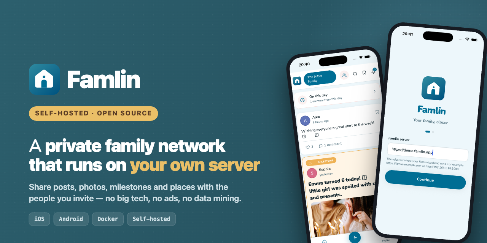

<p align="center">
  
</p>

# Famlin

[](LICENSE)

> ⚠️ **Very early stage.** Famlin is under active development and not yet stable. Expect breaking changes, rough edges, and incomplete features. **Use at your own risk** — do not rely on it for anything you're not prepared to lose or rebuild.

Private, self-hosted family updates app. Built with a Fastify + Prisma + Postgres backend and an Expo React Native mobile app.

- **Self-hosted** — run it on your own server (e.g. Synology NAS, VPS, or home server).
- **Private by default** — every post belongs to exactly one group, and only group members can see it.
- **Mobile first** — iOS and Android app built with Expo.
- **Admin web UI** — manage users, groups, and server settings from `/admin`.

## Table of contents

- [Quick start](#quick-start)
- [Project structure](#project-structure)
- [Useful commands](#useful-commands)
- [Production deployment](#production-deployment)
- [App Store / Play Store builds](#app-store--play-store-builds)
- [OIDC / SSO login](#oidc--sso-login)
- [Contributing](#contributing)
- [Troubleshooting](#troubleshooting)
- [License](#license)

## Quick start

You only need Docker to run the backend locally.

### 1. Environment variables

Copy the example file in the project root and edit the values:

```bash
cp .env.example .env
```

Fill in at least the following in `.env`:

- `JWT_SECRET` — a long random string (≥ 32 characters)

> For **local backend development without Docker** you can also use `backend/.env`. In Docker the values from the root `.env` are used.

### 2. Start the backend

```bash
docker compose up --build
```

The API is then available at http://localhost:3000.

### 3. Seed the database (sample data)

In a second terminal:

```bash
docker compose exec famlin-backend npx prisma db seed
```

This creates a group "Familie de Vries" with sample users and posts.

### 4. Test the mobile app

#### Option A — Expo web preview in Docker

```bash
docker compose -f docker-compose.mobile.yml up
```

Open http://localhost:8081 in your browser.

> Note: native features such as push notifications, camera, and SSO login will not work in the web preview.

#### Option B — Local Expo development build

If you have Node installed locally (and the backend is already running in Docker):

```bash
cd mobile
cp .env.example .env
npm install
npm run ios      # or npm run android
```

Scan the QR code with the Camera app (iOS) or the Expo Go app (Android).

> The backend server address is not hardcoded. At login the user enters the address themselves (for example `https://famlin.yourdomain.com`). For local development `http://localhost:3000` is used automatically if the field is left empty.
>
> SSO login is configured entirely on the server (see [OIDC / SSO login](#oidc--sso-login)) — the mobile app and admin UI discover it automatically, no build-time client IDs needed.

## Project structure

```
famlin/
  backend/                       Fastify API, Prisma schema, Docker image
    admin/                       React + Vite admin UI
  mobile/                        Expo React Native app
  docker-compose.yml             production/standard backend stack
  docker-compose.override.yml    local development with hot reload
  docker-compose.mobile.yml      Expo web preview in Docker
```

## Useful commands

```bash
# Follow backend logs
docker compose logs -f famlin-backend

# Reset the database
docker compose down -v
docker compose up --build

# Create a Prisma migration
docker compose exec famlin-backend npx prisma migrate dev --name description

# Open Prisma Studio
docker compose exec famlin-backend npx prisma studio
```

## Production deployment

`docker-compose.yml` runs the pre-built backend image from [`ghcr.io/timvanonckelen/famlin`](https://github.com/TimVanOnckelen/famlin/pkgs/container/famlin), published on every release — no source checkout needed on the server.

1. Point your reverse proxy (Traefik, Nginx, Caddy, etc.) to Famlin on port 3000.
2. Use `docker-compose.yml` without `docker-compose.override.yml`.
3. Place your `.env` on the server.
4. Make sure `famlin-db-data` is in your existing Docker data folder so it is included in your backups.

See [Server setup](https://famlin.app/docs/server-setup) for the full walkthrough, and [Maintenance](https://famlin.app/docs/maintenance) for pinning a version or building from source instead.

After the containers start, open `/admin` — a fresh database has no users yet, so you'll land on a one-time setup screen to create your admin account — then configure OIDC/SSO, allowed emails, and SMTP settings.

## App Store / Play Store builds

```bash
cd mobile
npx eas build --platform ios
npx eas build --platform android
```

Make sure you have:

- created an EAS project (`eas init`)
- an Apple Developer account + certificates for iOS
- a Google Play Console listing for Android

## OIDC / SSO login

Famlin supports login via any standards-compliant OpenID Connect provider (Google, Microsoft Entra ID, Authentik, Keycloak, Auth0, ...) alongside email/password. It's entirely optional and configured from `/admin` — no rebuild or client-side env vars required.

1. In your identity provider, register Famlin as a **public/native client** (no client secret) with **PKCE** enabled.
2. Add these redirect URIs:
   - Mobile app: `famlin://` (the app's URL scheme, see `mobile/app.config.js`)
   - Admin UI: `https://your-famlin-domain/admin/`
3. In `/admin` → Server settings, fill in:
   - **Issuer URL** — e.g. `https://accounts.google.com` or `https://auth.example.com/application/o/famlin/`
   - **Client ID**
   - **Scopes** — defaults to `openid email profile`
   - **Display name** — shown on the login button (e.g. "Google", "Authentik")
4. Optionally restrict which emails may sign in via **Allowed email addresses**.

> In Expo Go during local development the redirect URI is `exp://...` instead of `famlin://`. Use a local Expo development build or an EAS build to test the full SSO flow against your provider's redirect URI allowlist.

## Contributing

Contributions are welcome! Please read [CONTRIBUTING.md](CONTRIBUTING.md) for guidelines.

## Troubleshooting

### Port 8081 is occupied by Docker

If you run `npm run ios` locally while the Docker mobile preview is also running, Expo automatically picks a different port. Stop the Docker preview if you want to work locally:

```bash
docker compose -f docker-compose.mobile.yml down
```

### `expo-secure-store` does not work on web

The app automatically uses `AsyncStorage` on web and `SecureStore` on iOS/Android. This is already configured in `mobile/src/utils/storage.ts`.

## License

Famlin is released under the [MIT License](LICENSE).
