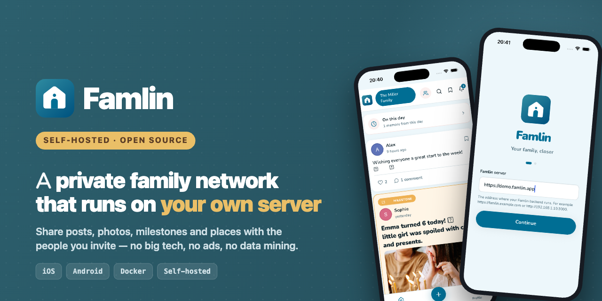

<p align="center">
  
</p>

# Famlin

[](LICENSE)
[](https://github.com/TimVanOnckelen/famlin/actions/workflows/ci.yml)
[](https://github.com/TimVanOnckelen/famlin/releases)
[](https://github.com/TimVanOnckelen/famlin/pkgs/container/famlin)
[](https://github.com/TimVanOnckelen/famlin/commits/main)
[](https://github.com/TimVanOnckelen/famlin/stargazers)

> 🤖 **AI-Assisted Project.** This codebase is developed with the assistance of AI. Code generation, architecture design, and development workflows leverage AI tooling.

> ⚠️ **Very early stage.** Famlin is under active development and not yet stable. Expect breaking changes, rough edges, and incomplete features. **Use at your own risk** — do not rely on it for anything you're not prepared to lose or rebuild.

**Private, self-hosted family updates — your family, on your own server.**

Famlin is a small social network for one family (or a few related ones): share updates, photos and videos, milestones, polls and trips with the people who matter, without handing any of it to a social media company. You run it on your own hardware, and only the people you invite can get in.

- **Self-hosted** — one Docker Compose stack on a NAS, a VPS or a home server.
- **Private by default** — a post is only visible to members of the families it was shared with, and a *circle* narrows that further to a smaller group within one family.
- **Apps everywhere** — free official [iOS](https://apps.apple.com/us/app/famlin/id6786783660) and [Android](https://play.google.com/store/apps/details?id=be.xeweb.famlin) apps, a web app served from the same server, and an admin UI at `/admin`.

## Features

- **One feed, several families** — belong to more than one family and filter between them, or share a post with several at once.
- **More than plain posts** — milestones that stand out, polls for family decisions, trips as a shared travel journal with check-ins, and shared albums anyone in the family can add to.
- **Stories** — a photo that's visible for 24 hours, with reactions and private replies. Pin the good ones as Highlights.
- **Reactions, comments and @mentions**, with photos and videos in comments too.
- **Family chat** — an optional group chat per family.
- **Your photos, your storage** — uploads stay on your server, and you can link existing albums from [Immich](https://immich.app) or a local folder.
- **Flexible login** — email and password, any OpenID Connect provider (Google, Microsoft, Authentik, Keycloak, …), or Sign in with Apple. Invite links make joining easy.
- **Your brand** — set your family's name, color and logo.
- **Multilingual** — English, Dutch and Simplified Chinese.
- **Export and restore** — download everything as one archive, and restore it into a fresh server.

📖 Full documentation: **[famlin.app/docs](https://famlin.app/docs)**

## Table of contents

- [Get the app](#get-the-app)
- [Self-hosting](#self-hosting)
- [Development](#development)
- [Project structure](#project-structure)
- [Community](#community)
- [Troubleshooting](#troubleshooting)
- [License](#license)

## Get the app

The official apps are free. Both ask for your server's address on first launch, so the same download works for every Famlin server.

- [**App Store**](https://apps.apple.com/us/app/famlin/id6786783660) (iOS)
- [**Google Play**](https://play.google.com/store/apps/details?id=be.xeweb.famlin) (Android)
- **Android without Google Play** — download the `.apk` from the [latest release](https://github.com/TimVanOnckelen/famlin/releases/latest). It's signed differently from the Play Store version, so uninstall one before installing the other.

Family members who'd rather not install anything can open your server's address in a browser.

## Self-hosting

You need a machine with Docker. Famlin ships as a pre-built multi-arch image (`linux/amd64` + `linux/arm64`) at [`ghcr.io/timvanonckelen/famlin`](https://github.com/TimVanOnckelen/famlin/pkgs/container/famlin), so no source checkout is needed.

```bash
mkdir famlin && cd famlin
curl -LO https://github.com/TimVanOnckelen/famlin/releases/latest/download/docker-compose.yml
curl -L -o .env https://github.com/TimVanOnckelen/famlin/releases/latest/download/env.example
# edit .env: set JWT_SECRET (32+ random characters) and POSTGRES_PASSWORD
docker compose up -d
```

Then open `http://your-server:3000/admin`. A fresh install has no users, so you'll see a one-time setup screen to create your admin account. From there you create your family, invite people, and optionally set up SSO, email and media integrations.

For production, put Famlin behind a reverse proxy with HTTPS (and set `TRUST_PROXY=true` in `.env` when you do), and make sure the `famlin-db-data` and `famlin-uploads` volumes are part of your backups.

Read more in the docs:

- [Server setup](https://famlin.app/docs/server-setup) — reverse proxies, Synology Container Manager, and a read-only demo mode
- [Admin configuration](https://famlin.app/docs/admin-configuration) — SSO (including Google and Apple), Immich and local folders, branding
- [Inviting family](https://famlin.app/docs/inviting-family) and [Managing users and content](https://famlin.app/docs/managing-users-and-content)
- [Maintenance](https://famlin.app/docs/maintenance) — updates, pinning a version, backups, and building from source

## Development

You need Docker and Node.js (`^20.19.0` or `>=22.12.0`). The full guide is the [developer quick start](https://famlin.app/docs/developers/quick-start).

```bash
cp .env.example .env    # set JWT_SECRET and POSTGRES_PASSWORD
docker compose up --build    # backend on http://localhost:3000, hot reload via docker-compose.override.yml
```

In a second terminal, load sample data (a "Familie de Vries" family; log in as `admin@example.com` / `test123456`):

```bash
docker compose exec famlin-backend npx prisma db seed
```

**Web app** — `web/` and the shared `packages/api-client` are npm workspaces at the repo root:

```bash
npm install        # repo root: links and builds @famlin/api-client
npm run dev:web    # Vite dev server on http://localhost:5174, /api proxied to the backend
```

**Mobile app** — uses a development build (`expo-dev-client`), not Expo Go:

```bash
npm install        # repo root first: mobile's @famlin/api-client dependency is built by it
cd mobile
cp .env.example .env
npm install
npm run ios        # or: npm run android (needs Xcode / Android Studio)
```

Leaving the server field empty at login uses `EXPO_PUBLIC_API_URL` from `mobile/.env`: `http://localhost:3000` on the iOS simulator, `http://10.0.2.2:3000` on the Android emulator.

**Tests** — `cd backend && npm run test:docker` runs the backend suite inside the dev container against a separate test database. `npm test` in `web/`, `mobile/` and `packages/api-client/` runs their unit tests.

Useful commands:

```bash
docker compose logs -f famlin-backend                                        # follow backend logs
docker compose down -v && docker compose up --build                          # reset the database
docker compose exec famlin-backend npx prisma migrate dev --name description # create a migration
docker compose exec famlin-backend npx prisma studio                         # browse the database
```

## Project structure

```
famlin/
  backend/                 Fastify + Prisma API, Docker image
    admin/                 React + Vite admin UI (served at /admin)
  web/                     React + Vite member-facing web app (served at /)
  mobile/                  Expo React Native app (iOS + Android)
  packages/api-client/     shared API/data layer for web + mobile
  docs/                    Docusaurus documentation (famlin.app/docs)
  website/                 landing page (famlin.app)
  design/                  styleguide, the source of the design tokens
  docker-compose.yml       production stack (pre-built image)
  docker-compose.override.yml  local development with hot reload
```

The [architecture overview](https://famlin.app/docs/developers/architecture) explains how the pieces fit together, and there's an [API reference](https://famlin.app/docs/developers/api) for building your own scripts and integrations.

## Community

- 💬 **Questions and self-hosting help** — [GitHub Discussions](https://github.com/TimVanOnckelen/famlin/discussions)
- 🐛 **Bugs and feature requests** — [open an issue](https://github.com/TimVanOnckelen/famlin/issues/new/choose)
- 🔒 **Security issues** — please report them privately, see [SECURITY.md](SECURITY.md)

### Contributing

Contributions are welcome, whether that's code, docs, translations or bug reports. Before opening a pull request, please read:

- [CONTRIBUTING.md](CONTRIBUTING.md) — how to contribute
- [AI-GUIDELINES.md](AI-GUIDELINES.md) — how to use AI responsibly when working on Famlin
- [CODE_OF_CONDUCT.md](CODE_OF_CONDUCT.md)

### Contributors

Thanks to everyone who has contributed to Famlin!

<!-- Generated by .github/workflows/contributors.yml (bots and AI accounts excluded) — don't edit by hand. -->
<!-- CONTRIBUTORS:START -->
<a href="https://github.com/TimVanOnckelen"></a>
<a href="https://github.com/codewec"></a>
<!-- CONTRIBUTORS:END -->

## Troubleshooting

### `npm install` in `mobile/` fails with `tsc: command not found`

Run `npm install` in the repo root first — mobile's `@famlin/api-client` `file:` dependency is built by the root workspace install.

## License

Famlin is released under the [MIT License](LICENSE).
